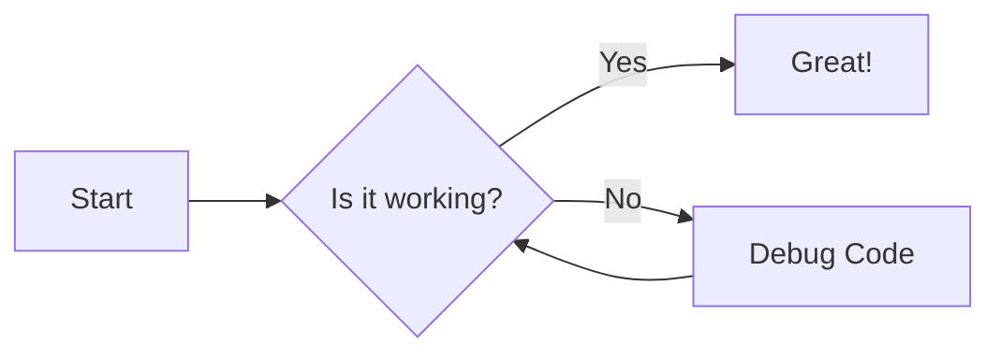
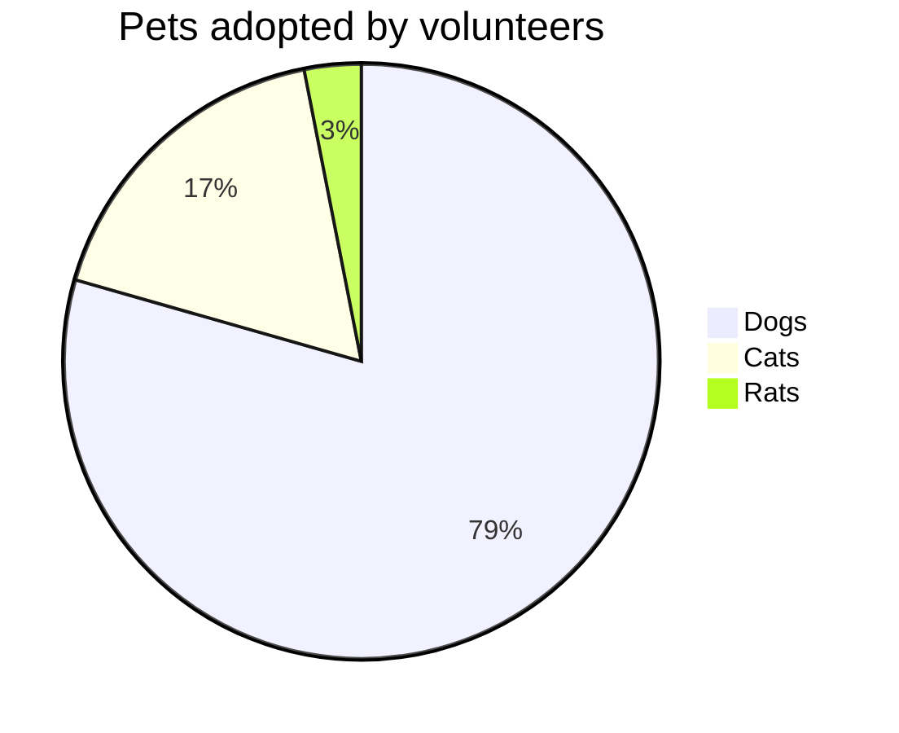

# GFM

## Autolink literals

www.example.com, https://example.com, and contact@example.com.


## Footnote

A note[^1]

[^1]: Big note.

## Strikethrough

~one~ or ~~two~~ tildes.

## Table

| a | b  |  c |  d  |
| - | :- | -: | :-: |
| item 1 | item 2 | item 3 | item 4 |

## Tasklist

* [ ] to do
* [x] done

## Code
```ts
let x = 10;
console.log(x);
```

## Mermaid


